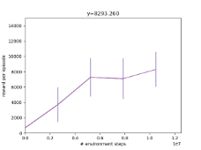

19

**Project Main Area: Software**

**Project Thematic Area 	: Artificial Intelligence**

**Project Name (Title) 	: Environment-Aware Automatic Robot Optimization Using Genetic Algorithm and Deep Reinforcement Learning**

**Contents** :

1. Summary………………………………………………………………….2
1. Purpose……………………………………………………….…….……..2
1. Introduction………………………………………………………….……2
1. Method……………………………………………………………….…3
   1. Physics Simulation and Model Methods…………………..……3
      1. MuJoCo……………………………………………….…...3
      1. MJX/Brax/JAX……………………………………………..3
      1. Preparation of Base Robot………………………………...3
      1. Scanning the Environment with NeRF…………………………………..4
      1. Preparation of Experimental Environments………………………....4
         1. Running Task on Flat Ground with Humanoid Robot……..4
         1. Extra Environments……………………………………..5
         1. Things to Consider……………………………….5
   1. Algorithmic Method……………………………………………….6
      1. Reinforcement Learning………………………………………...6
         1. Proximal Policy Optimization………………………6
         1. Transfer of Learning…………………………………..7
         1. Eureka………………………………………………8
      1. Dynamic XML Models……………………………….....9
      1. Genetic Algorithm…………………………………………11
         1. Diversity and Selection……………..……….…………11
         1. Robot Education……………………………………..11
         1. Early Elimination………………………………………..12
         1. Algorithm Pseudo code……………………………………..13
1. Project Work Schedule………………………………………………..13
1. Findings………………………………………………………………14
1. Conclusion and Discussion………………………………………………..16
1. Sources………………………………………………………………..18

**Summary**

Although robot designs by machines may seem like a distant concept at the moment, there have been serious studies on this subject for several years. The interest in the problem of automatic optimal robot design for a given task and terrain is due to the wide application areas of the problem. It has the potential to create many remarkable solutions from debris search and rescue to military industry, from logistics in difficult terrain to assisting in construction work. However, a number of dead ends of the problem keep today's techniques away from these goals. Most of these studies require high runtime and computational power, which is why they have insanely large search spaces for robot designs. The method we present is to take a base robot and optimize the dimensions of its components using a unique genetic algorithm customized for our purposes. During the genetic algorithm, we use Reinforcement Learning so that the robot can learn the given task and be selected according to its ability to do the task. What distinguishes our work from previous ones is that we develop new optimization methods as well as bringing terrain-specific robot optimization production one step closer to realism. Thanks to the software we use in our project that converts 2D videos into 3D models, we have obtained a system where we can operate our robots in real-life environments. We provided an application of 3D terrain scanning for Mount Ararat. When the base Humanoid robot prepared by leading experts and our output Humanoid robot that we received from the genetic algorithm were compared in the same setup, by training 20M time step in a running task on flat ground, it was observed that the score of our output robot was 257% of the score of the base robot.

**Keywords :** Artificial Intelligence, Reinforcement Learning, Robotics, Genetic Algorithm

**Aim**

The goal of the project is to find robotic designs that will optimally perform any predetermined task by simulating specific real-life environments in physics engines, using reinforcement learning and genetic algorithms, or to identify modifications needed to adapt an old design.

**Entrance**

The development of mobile robots and their use as auxiliary tools in certain application areas dates back to the mid-20th century, and their development has continued rapidly in recent years [1].

Studies in the field of artificial intelligence are an important factor in the acceleration of robotic studies. Although there are many algorithms that will enable robots to perform a given task, the applicability of the framework algorithm it creates to many situations and the fact that it can be used without any model knowledge in complex physical models puts reinforcement learning in an important position. The advantage of physics simulations here is that they allow the robot to be trained in computer environments that are astronomically accelerated compared to real life. In recent years, physics simulations and reinforcement learning have made significant progress thanks to the increasing hardware power.

Although our algorithms that determine the behavior of robots can create more optimal behavior patterns than those produced manually by humans without human control, the situation is reversed when it comes to designing robots. Almost all of today's robot designs are designed by humans.

this project is to find robotic designs that will best perform a specified task in a specified physical environment/terrain.

Although producing optimal robot designs without human input has become a problem that has gained importance in recent years, the theoretically possible existence of robots and the abundance of their behaviors significantly expand the search space. We solve this problem with an algorithm where the sizes and lengths of the robot's components are optimized on a fixed kinematic tree where generations can transfer their behaviors (Policy Network Weights and Bias) through inheritance (Learning). At the same time, the studies so far often produce results in unrealistic virtual 3D environments, in order to get one step closer to real life use, we integrated NeRF technology into our project to scan real terrains in 3D and use it with our algorithm.

**Method**
**
`	`The project method is classified under two main headings. Physics simulation tools/libraries and reinforcement learning environments consisting of physical system - task (reward function) pairs are given in 4.1, and detailed explanations of the algorithms we used and developed are given in 4.2.

**4.1 Physics Simulation and Model Methods**

`	`**4.1.1 MuJoCo**
**
`		`MuJoCo[2], which we used for physics simulation in our project, is a general-purpose physics engine developed by DeepMind, a pioneer in the artificial intelligence sector, that aims to facilitate research and development in robotics, biomechanics, graphic animation, machine learning and other fields that require fast and accurate simulation of articulated structures that interact with their environment. Its name stands for Multi Joint Dynamics with Contact. MuJoCo receives information such as the physical environment to be simulated, objects, and simulation configuration via an XML file that follows the language they call the MJCF modeling language. Therefore, robots and their physical environments are prepared in this format.

`	`**4.1.2 MJX/Brax/JAX**
**
`		`JAX is an open source numerical computational library developed by Google Research.** Its advantage over its counterpart, NumPy, is that it supports GPU/TPU parallelization. Thanks to GPU/TPU parallelization, it enables many environments to work in parallel during Reinforcement Learning, significantly speeding up the algorithm. MJX is a JAX-based version of the MuJoCo physics engine to allow parallelization in simulations. Although the Brax[3] library is actually a physics engine, the Brax physics engine was not used in this project, Brax's JAX-based and MJX-compatible RL environments and the PPO algorithm in it were used.

**4.1.3 Preparing the Base Robot**

The robot that we will optimize in the experiments is taken from MuJoCo's Github[4]. Our robot has 21 joints and has limited control over all of them.

**

**Image 1. Base Robot Image 2. Base Front View 	Robot Side View

**4.1.4 Scanning the Environment with NeRF**

NeRF (Neural Radiance Fields) [5] is a neural network architecture that takes two-dimensional images as input and reconstructs them in three dimensions. Using NeRF, we transferred the Mount Ararat image we obtained from Google Earth Studio to a 3D environment. We integrated the 3D model we obtained into MuJoCo and used it in one of our environments. The reason we entered the real-life 3D model business in our project is to show how close the findings of our project are to real life. Although NeRF is a technology that requires high processing power, there are companies such as Luma AI [6] that offer it for free.

**Image 3. Image Taken from Google Earth Image 4. Image of the Pain Model**

**4.1.5 Preparation of Experimental Environments**

**4.1.5.1 Running Task on Flat Ground with Humanoid Robot:**

**Agent:** Humanoid Robot

**Experiment Description:** In this task, our genetic algorithm optimizes the components of the humanoid robot based on how well it can run on a flat surface.

**

**Code Snippet 1. Reward Function for Race**

**Image 5. Image of the Environment**

**Extra Environments**

The experimental environments given below were designed entirely by us and have not been implemented.

||||||||
| :- | :- | :- | :- | :- | :- | :- |
|Image 6. Extra Environment|Image 7. Extra Environment|Image 8. Extra Environment|Image 9. Extra Environment|Image 10. Extra Environment|Image 11. Extra Environment|Image 12. Extra Environment|

**Things to Consider 4.1.5**

**NAN error (Not a Number):** Since our project is full of cyclic calculations, we worked meticulously on optimization. However, there is a point that needs to be taken into consideration during the work process.** We have come across this element. If you are doing such experiments in physics simulations like MuJoCo, PyBullet, Isaac Gym etc., you need to make sure that the physics simulation can handle the complexity of your experimental environment. If it can't, it won't show it right away, and after a certain point - we're talking about hours here - it will give you NAN output. To solve this problem, you need to gradually increase the computation frequency of your MuJoCo environment.

**Environment Optimization:** In order for our Genetic Algorithm and Reinforcement Learning to work quickly, it was very critical in our project that the environment could work quickly without losing data. That's why we tried various methods. The first of these was to choose which collisions to calculate depending on the task, for example, in our running task, there is no need to calculate collisions of any part of the robot other than the foot and it does not need to touch anywhere, we already reposition the robot when it falls to the ground. Thanks to this setting, our robot can learn 4 times faster in the Reinforcement Learning phase.

**Figure 13. Simulation Parameters**

Apart from this, we optimized the output given by Luma AI in our Mount Ararat mission so that it would not affect the simulation too much.

**4.2**

**4.2.1 Reinforcement Learning**

**4.2.1.1 Proximal Policy Optimization**

Reinforcement Learning is a machine learning algorithm that has been popular since the early 2000s - mostly used for training robotic systems. PPO (Proximal Policy Optimization) [7] is a more powerful and faster reinforcement algorithm than its counterparts, developed by OpenAI in 2017. is a learning algorithm. In our project, we combined PPO with MuJoCo and used it to help our existing robots learn the given task.

The Reinforcement Learning approach abstracts the idea that there is an agent that observes the state of the environment around it, interacts with it through its actions, and learns to increase the reward it receives as a result of its actions.

`			       `**Figure 1. Reinforcement Learning[15]**

By going through this general and useful abstraction, we can use the power of Reinforcement Learning

It is derived from the Bellman equation[8]:

![ref1]![ref2]

vLet the value function be the total reward that an agent in a given state s can expect to receive if it takes the optimal actions. The rewards γ∈0,1 are multiplied by the discount factor at each subsequent step (future rewards are less important) and are the probability of moving p(s',r|s,a) a from state s'to state rwith the sreward it receives. We can call the action that maximizes the optimal value function athe optimal policy. The Bellman equation intuitively tells us sthat the value of a state in an optimal value function s'should be equal to the expected optimal values of the states to be reached if the optimal action is taken. An optimal policy may not exist in infinite value and action spaces, but we can iteratively optimize a given policy. A common way to do this is to take the policy function that determines the action as a deep neural network and parameterize the function with the weights and biases of the neural network. θThe objective function that measures the success of the policy generated by its parameters is defined as follows:

Here is a trajectory (a sequence of state-action pairs). With some mathematical manipulation τ=(s1,a1,s2,a2,...), an approximate objective gradient can be obtained that does not require system dynamics (system dynamics are required for the probability of a particular trajectory occurring ( p,Pgiven by probability functions):

Thanks to this approximate gradient, we can of course perform policy learning by updating the parameters. What the Proximal Policy Optimization algorithm does is to make vanilla policy optimization more robust by making some restrictions on the updating of the parameters, defining an objective that allows multiple parameter updates per data, etc. Due to its experimental success and suitability for our purpose, we enable robots to learn the task during the genetic algorithm with PPO.

`	`**4.2.1.2 Transfer of Learning**

`	`The naive method for training in genetic algorithms is to train child robots as they are, whose dimensional parameters have changed slightly from those of the parent robot. However, if we consider that the structure of the parent robot and the structure of the child robot have changed very little, it is quite inefficient for the child robots to learn the things that the parent robot has learned over and over again. It should also be noted that the components of the parent robot are slightly different from the children, and if the policy parameters are directly transferred to the children, the child robots cannot perform the task with parameters that have not been trained with their own components. The solution here is to accept the learning parameters of the parent robot as a starting point and train them on the child robots. Experimentally, this method significantly accelerates the learning of child robots.

Although transfer learning is an important practice, the Brax internal PPO algorithm that we use for compatibility with all our physical simulations and RL environments does not allow such a structure. Therefore, we modified the Brax library's ppo.train function, as it is important for the efficiency of our transfer learning algorithm. With the changes we wrote, the function allows transfer learning to its own training process by taking a simple argument, and also returns its own learning parameters in the same object type and format for use in another training.

**Code Section 2. Learning Transfer**

`	`**4.2.1.3 Eureka**

Eureka[9] is a tool developed by NVIDIA in 2023 that can write reward functions for a given task using Large Language Models (GPT 3.5). The working principle of Eureka, which can write reward functions better than 83% of experts, is as follows.

`			         `**Figure 2. Eureka**

Eureka gives the environment code and task description it receives to a language model. In the next part, this language model instantiates as many reward functions as the user wants. It passes the instantiated reward functions to Isaac Gym [10], NVIDIA's physics simulation application. The reward function is improved with the feedback received from Isaac Gym, and this process continues in a loop. In our project, Eureka works in a way that gives a single reward function - that is, it cannot enter a loop - because Eureka is designed to receive feedback from Isaac Gym, but we use MuJoCo for feedback. Another problem here is that since MuJoCo is a new tool, most Language Models do not know how to access the data in MuJoCo. Although Eureka is not very powerful in our project, it is a tool that greatly increases the potential of our project with the development of Large Language Models and MuJoCo.

**4.2.2**

**4.2.1 Dynamic XML Models**
**
`	`In our project, we need to be able to change the components of the base robot to create diversity during the genetic algorithm. However, automating this process is not as simple as it seems at first glance. Because the modeling language from which MuJoCo receives information about the environment and the robot, such as materials, actuators, joint connections, etc., is MJCF, XML format and static. In detail, the components of our base robot, which we use for the experimental environment, are determined as capsules,

**Code Snippet 4. Default Geom Parameters**

There are two arguments that determine the physical structure of a capsule, the radius (size) and the 3D coordinates (from-to). For example

an XML with this code snippet (with default definitions not shown),

`				`**Code Snippet 5. Sample XML snippet**

If run in MuJoCo, you will get an image like this:

`					    `**View 14**

If we multiply the to vector of the from-to argument, which determines the right upper arm coordinates, by two relative to the from vector, in order to extend the right upper arm of the humanoid with a naive method, the change we obtain is as follows:

`       `**View 15**

As can be seen, the coordinate vectors of the lower arm must also be calculated in a way that is dependent on the upper arm, otherwise the desired change will not be achieved and the robot will malfunction. Since we realized that the dependency chain becomes more complex as the number of components increases, we developed an algorithm that will do this job systematically. The algorithm's access to XML is provided by the xml.tree.ElementTree module in Python. The algorithm takes as input the list of numbers to be multiplied by the lengths and radii of the components and gives the MJCF model multiplied by these factors as output. At the same time, the model assumes a symmetric change because the advantage of the robot being asymmetric is small and it increases the number of parameters to be optimized considerably. If we give the algorithm a list of 1s as the number of parameters as input, we get the base robot as output. We can easily obtain the example above by writing 2 in the correct order in the input of the algorithm and 1 for the remaining ones:

`					 `**Image 16**

We have made another version based on the Quadruped model with the same functionality. Below you can see images of some sample robots.

`					`****

`	`**Figure 17. Sample robots generated with Dynamic XML Algorithm**

**4.2.3 Genetic Algorithm**
**

`	`**4.2 .3.1 Diversity and Selection**
**
`	`If the scaling variables that the genetic algorithm needs to search on are directly in the form that the Dynamic Robot XML algorithm takes, we encounter a subtle problem. The multiplier variables do not allow negative values, and - if we mutate the variables using a symmetric distribution such as a normal or uniform distribution - it is much easier to grow than to shrink. In order for this not to harm the stability of the genetic algorithm, we apply a pointwise transformation between the variables that the genetic algorithm changes and the variables sent to the Dynamic XML:

After this development, different distributions can be used. We preferred the discrete uniform distribution to keep the scaling variables simple. The range of the distribution ( ϵ) was chosen as 0.1 and n = 5, so for each mutation, one of the numbers -0.1, -0.05, 0, 0.05 and 0.1 will be added to the variable with equal probability for each change in the variable. The base robot therefore now corresponds to the robot with all scaling variables equal to 0.

In selection, we simply compare the reward/episode values in the last measurement obtained at the end of 10 million timesteps. Only one robot is selected in each generation and the others are eliminated. The selected robot is preserved across generations but is not retrained in each generation. Newly produced robots receive learning transfer from their ancestors and 4 new robots are produced in each generation.

`	`**4.2.3.2 Robot Education**

`			`**Code Snippet 6. Robot Class**

Within the scope of our software, what we call a robot is defined by 3 variables: scaling variables, xml model (directory where it is saved), brain (training parameters for PPO). Training the robot means training and updating the robot's brain.
**
`	`The training phase in the genetic algorithm is the phase where the newly produced robots in the generation are trained for 10 million timesteps with the reinforcement learning algorithm PPO detailed in 4.2.1. This phase is critical for the genetic algorithm to select robots according to their behavioral capacity.
**

`	`**4.2.3.3 Early Elimination**
**
`	`The early elimination system is a point that makes our genetic algorithm unique. Let's give the intuitive motivation for early elimination. After at least one robot is trained in each generation, the newly trained robot must pass the best of the previous robots in order not to be eliminated. If we could somehow know whether a robot will pass the other or not before training, our algorithm would be much faster because the only stage in the algorithm that consumes negligible time is the training stage, which takes 5 minutes and 30 seconds for each robot with 10M timestep, despite GPU acceleration. We run 5 reward/episode measurement stages during training. The exact scores are already the 5th measurements. If the new robot is not close enough to the old one in the 4th stage, we can assume that it will not pass in the 5th stage. Similarly, the 3rd measurements point to the 4th measurements with a slightly larger deviation. If we continue like this, it can be shown that if the newly trained robot's measurements fall below a lower bound dependent on the previous robots of the same generation, it will increase the efficiency without causing any algorithmic loss. This lower bound should be abundant in the first measurements to give a chance to the new robots, and in the following measurements, it should approach it in such a way that it will be the same as the previous best. r(t), t=1,2,3,4,5If rthe best (the best means the one with the highest last reward) is the measurement-reward function of the robot so far, then the lower bound dependent on t for the newly trained robot is given by:
**
`	`because we want γ=0.2≃ln(3)/5the lower bound to be at t=1 r/3.

**4.2.3.4 Algorithm Pseudocode**

**Algorithm 1. Genetic Algorithm**

**Project Work-Timeline**

|**MONTHS**||||||||
| :-: | :- | :- | :- | :- | :- | :- | :- |
|**Job Description**|**July**|**August**|**September**|**October**|**November**|**December**|**Fireplace**|
|Literature Review|**X**|**X**|**X**|**X**||||
|Designing Methods||**X**|**X**|**X**||||
|Application of Methods|||**X**|**X**|**X**|**X**||
|Data Collection and Analysis|||||**X**|**X**|**X**|
|Project Report Writing||||||**X**|**X**|

**Findings**

**Gen 0 Robot 0 			Gen 5 Robot 0 			Gen 10 Robot 1**

**Gen 20 Robot 3 			Gen 30 Robot 2 			Gen 38 Robot 3**

**Gen37 Robot 0**                 **Gen37 Robot 1** 		**Gen37 Robot 2**	     **Gen37 Robot 3**

`			           `**Graph 1. Robot Learning Curves**

The graphs above are for observing the general progress between generations, while the ones below are examples of all robots of the 37th generation to show the differences within generations. The graphs include transfer of learning and are the learning graphs obtained only while training the specified robot. The changes in the scaling variables across generations are as follows:

0\. Generation Scaling Variables: [-0.05 0.1 0.1 0. 0.05 -0.05 -0.05 0. -0.05 -0.05 0. 0.05 0. -0.05 0.1 -0.1 0.05]

5\. Generation Scaling Variables: [-0.1 0.1 0.15 0.1 0.3 -0.15 -0.25 -0.2 0. 0. -0.35 0. -0.05 -0.3 0.35 -0.3 0.2 ]

10\. Generation Scaling Variables: [-0.55 0.1 -0.05 0.2 0.25 0. -0.35 -0.35 -0.05 -0. -0.5 -0.05 0. -0.25 0.5 -0.55 -0.3 ]

15\. Generation Scaling Variables: [-0.35 0.25 0.1 -0. 0.4 0.25 -0.25 -0.1 0. 0.1 -0.35 0.05 -0.25 0.05 0.5 -0.65 -0.4 ]

20\. Generation Scaling Variables: [-0.6 0.15 -0.25 0.05 0.4 0.3 -0.1 -0.1 -0.15 -0.05 -0.7 -0.2 -0.1 -0.05 0.35 -0.65 -0.3 ]

25\. Generation Scaling Variables: [-0.55 0.15 -0.1 0.25 0.4 0.2 -0.05 -0.2 -0. -0.05 -0.75 -0.35 -0.2 -0.15 0.3 -0.8 -0.45]

30\. Generation Scaling Variables: [-0.9 0.35 0.1 0.2 0.4 0. -0.05 -0.35 -0. -0.2 -0.65 -0.3 -0.2 -0.3 0.45 -0.95 -0.45]

35\. Generation Scaling Variables: [-1. 0.4 0.2 0.15 0.4 -0.1 -0.25 -0.25 0.1 -0.2 -0.55 -0.3 -0.45 -0.35 0.25 -0.95 -0.7 ]

38\. Generation Scaling Variables: [-1.2 0.45 0.25 0.15 0.45 -0.15 -0.3 -0.3 0.05 -0.2 -0.6 -0.15 -0.4 -0.25 0.3 -1. -0.7 ]

**Image 18. Base Robot**

**Image 19. Gen 38 Robot 3**

`	`the base robot and the 3rd robot of the 38th generation by training 20M time step without transferring learning, we obtain the above graph. The red line gives the learning curves of the base robot and the blue line gives the learning curves of the output robot.

`		`**Graph 2. Base Robot Output Robot Comparative Training Curves**

Results obtained at the end of 20M timestep training:

Base Robot - 802 Awards/Episode

Output Robot - 2069 Awards/Episode

**Conclusion and Discussion**

When the first graphs of the findings are examined, the development between generations can be clearly seen. Most robots slowed down and plateaued when they reached a certain reward/episode level. It can be argued that after this plateau formation, the genetic algorithm worked more effectively and that the physical structure of the robot (scaling variables) determined the height of the plateau while the robot increased the curve it learned to that plateau. This explains the finding when our output robot was compared to the base robot. The fact that the plateau level was reached in the learning curves in a relatively short time shows the success of the learning transfer between generations. It can be thought that the changes in the components of the robot (shoulder growth, forearm reduction, upper body shortening and widening, etc.) serve the purposes of keeping the center of gravity stable and helping to maintain balance. At the same time, when the scaling variables are examined, we observe that some variables have undergone significant changes.

The robots for which we provided learning curves for the 37th generation experimentally demonstrate the usefulness of the early elimination system. Robot 0 did not learn badly, but considering that the information learned up to the 37th generation was transferred, it is not a good choice either. Robot 1 is probably an unstable robot that does not show promise in the first 2M timestep, and since it remains below the early elimination lower limit, it was eliminated without consuming more time and computational resources. Robot 2 achieved a good result, so although robot 3 is successful compared to robots 0 and 1, it is eliminated when it is in a position where it is unlikely to pass robot 2. As can be seen, testing 4 new robots for the 37th generation took almost as much time as testing 2 robot.

**Source​**

1- Raj, R.; Kos, A. A Comprehensive Study of Mobile Robot: History, Developments, Applications, and Future Research Perspectives. *Appl. Sci.* 2022, *12* , 6951. <https://doi.org/10.3390/app12146951>

2- E. Todorov, T. Erez and Y. Tassa, "MuJoCo: A physics engine for model-based control," *2012 IEEE/RSJ International Conference on Intelligent Robots and Systems* , Vilamoura-Algarve, Portugal, 2012, pp. 5026-5033, doi: 10.1109/IROS.2012.6386109.

3- C. Daniel Freeman, Erik Frey, Anton Raichuk, Sertan Girgin, Igor Mordatch, & Olivier Bachem. (2021). Brax – A Differentiable Physics Engine for Large Scale Rigid Body Simulation.

4- Tassa, Y. and Tunyasuvunakool, S. (2021) *Multi-Joint dynamics with Contact. A general purpose physics simulator.* , *GitHub* . Available at: https://github.com/google-deepmind/mujoco/blob/main/model/humanoid/humanoid.xml

5- Ben Mildenhall, Pratul P. Srinivasan, Matthew Tancik, Jonathan T. Barron, Ravi Ramamoorthi, & Ren Ng. (2020). NeRF: Representing Scenes as Neural Radiance Fields for View Synthesis.

6- DeVries, T., Neff, T. and Yu, A. (2021) *Building multimodal AI to expand human imagination and capabilities* , *lumalabs.ai* . Available at: <https://lumalabs.ai/>

7- John Schulman, Filip Wolski, Prafulla Dhariwal, Alec Radford, & Oleg Klimov. (2017). Proximal Policy Optimization Algorithms.

8- Bellman, Richard Ernest. (1954) The Theory of Dynamic Programming.

9- Yecheng Jason Ma, William Liang, Guanzhi Wang, De-An Huang, Osbert Bastani, Dinesh Jayaraman, Yuke Zhu, Linxi Fan, & Anima Anandkumar. (2023). Eureka: Human-Level Reward Design via Coding Large Language Models.

10-Viktor Makoviychuk, Lukasz Wawrzyniak, Yunrong Guo, Michelle Lu, Kier Storey, Miles Macklin, David Hoeller, Nikita Rudin, Arthur Allshire, Ankur Handa, & Gavriel State. (2021). Isaac Gym: High Performance GPU-Based Physics Simulation For Robot Learning.

11- Bisong, E. (2019). Google Collaboratory. In *Building Machine Learning and Deep Learning Models on Google Cloud Platform: A Comprehensive Guide for Beginners* (pp. 59–64). doi:10.1007/978-1-4842-4470-8\_7

12- Jones, R., Barton, T., Xu, X., Wang, K., Jiang, E., Guerrero, P., Mitra, N., & Ritchie, D. (2020). ShapeAssembly: learning to generate programs for 3D shape structure synthesis *. ACM Transactions on Graphics, 39(6), 1–20.*

13- Wenzhe Li, Hao Luo, Zichuan Lin, Chongjie Zhang, Zongqing Lu, & Deheng Ye. (2023). A Survey on Transformers in Reinforcement Learning.

14-Zhao, M., Li, T., Alsheikh, M., Tian, Y., Zhao, H., Torralba, A., & Katabi, D. (2018). Through-Wall Human Pose Estimation Using Radio Signals. In *2018 IEEE/CVF Conference on Computer Vision and Pattern Recognition* (pp. 7356-7365).

15- Sutton, RS, & Barto, AG (2018). *Reinforcement learning: An introduction* . MIT press.

16- Zhao, A., Xu, J., Konaković Luković, M., Hughes, J., Speilberg, A., Rus, D., & Matusik, W. (2020). RoboGrammar: Graph Grammar for Terrain-Optimized Robot Design *. ACM Transactions on Graphics (TOG), 39(6), 1–16.*

17-Shiuh-Jer Huang, & Ruey-Jing Lian (1997). A hybrid fuzzy logic and neural network algorithm for robot motion control *. IEEE Transactions on Industrial Electronics, 44(3), 408-417.*

[ref1]: Aspose.Words.9df18bd9-d378-4af8-8b39-ee8dc5c52abf.016.png
[ref2]: Aspose.Words.9df18bd9-d378-4af8-8b39-ee8dc5c52abf.017.png
